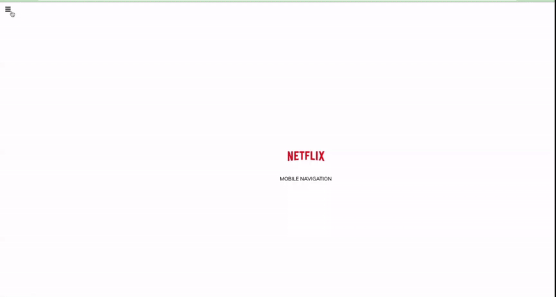

# Netflix Navigation 🔥

The **Netflix Mobile Navigation Application** is a web-based project that aims to replicate the mobile navigation experience of the popular Netflix app. Users can interact with the navigation icon in the top-left corner, triggering a transition effect that mimics the appearance of the Netflix interface. The navigation icon smoothly transitions between three different colors (white, red, and black), and when closed, it smoothly transitions back with a slight delay to closely resemble the Netflix app's behavior. The project is built using HTML, CSS, JavaScript, and Font Awesome for icons.

## Deployed Link & Demo

[Click here](https://iqbalahmadi.github.io/Netflix-Mobile-Navigation/)  

## Features

- **Mobile Navigation Icon:** A navigation icon is positioned at the top-left corner, just like in the Netflix app.
- **Smooth Transition:** When clicked, the navigation icon smoothly transitions between three colors: white, red, and black.
- **Realistic Close Behavior:** When the navigation is closed, it smoothly transitions back to its initial state, mimicking the Netflix app's behavior.
- **Responsive Design:** The application is designed to work seamlessly on various screen sizes and devices.

## Usage

1. Open the index.html file in your web browser.
2. Click on the navigation icon located at the top-left corner.
3. Observe the smooth color transition and the delayed return to the original state when closing the navigation.

## Customization

You can customize various aspects of the Netflix Mobile Navigation Application to match your preferences:

- **Colors:** You can change the colors used for the navigation icon's transition. Open the `styles.css` file and modify the color values in the appropriate classes.

- **Icons:** The project uses Font Awesome icons. You can replace the navigation icon with another icon from the Font Awesome library by changing the class name in the `index.html` file.

- **Transition Speed:** If you want to adjust the speed of the transition, you can modify the transition duration in the `styles.css` file.
